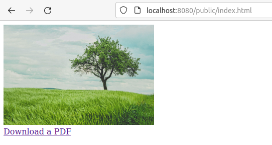

## Serving static files from a directory

An example of serving static files is available by running [static_files.nim](./static_files.nim).
From the project root, run:

```
nimble install
nim c examples/static_files.nim
./examples/static_files
```

Example output:

```
➜  meira git:(main) ✗ ./examples/static_files        
Serving on http://localhost:8080
In a browser, open: http://localhost:8080/public/index.html
```

When opening the [suggested link](http://localhost:8080/public/index.html) in a browser, you should see a basic web page:




